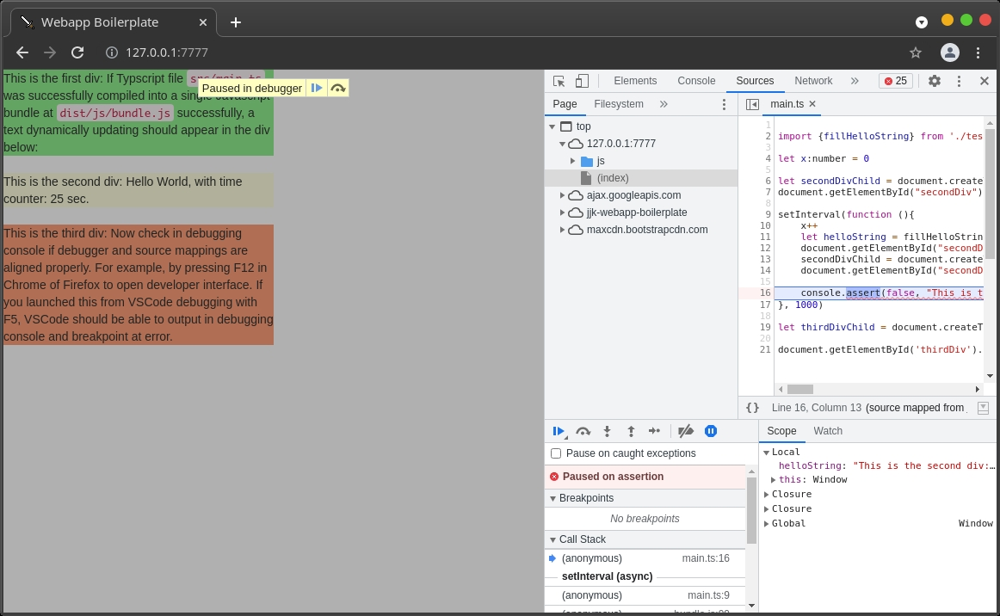
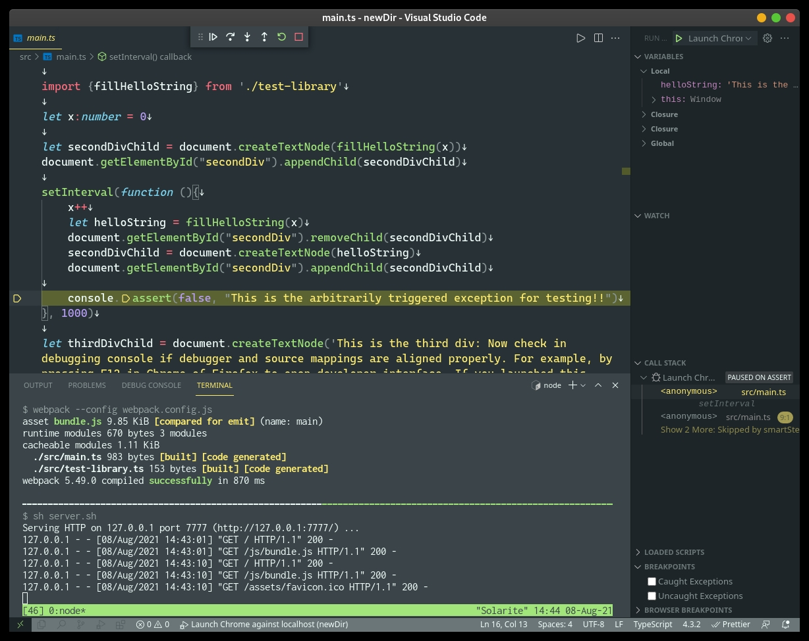

# Webapp Prototyping Boilerplate

## Motivation

Initial setup of `webpack`, `typescript` and `babel` everytime I just wanted to get webapp prototype going has always been a pain. So I needed to make a simple template/boilerplate I can copy/paste on the go.

I use this for prototyping webapp for my work and projects. Feel free to use if you find it useful.

## Requirements:
Need to have the following installed.

- `yarn` or `npm`
- `python3` (for `http.server` module)
- `tmux` (optional. for dividing terminals)
- `vscode` and `chrome` (optional. for debug breakpoint synchronized into `vscode`)

Tested only in Manjaro/Arch Linux and no other distributions/OS.

## Just get me started:
In your terminal (Linux for exmaple):
- `git clone` this repository. `cd` into local repository.
- Install: `yarn install` (or use `npm` if you wish)
- Start Server: `yarn start`

  (if you don't have `tmux`, you can start `yarn start_webpack` and `yarn start_server` on two separate terminals.)

- Open `http://127.0.0.1:7777` in your local web browser

If you see something like the following, you are successful:

Opened in Chrome with Developer Tools <key>F12</key> on


(Optional) Debugging breakpoints synchronized into VSCode:

## To start adding your own code with a clean `git` history:

First `git clone` current repository. `cd` into the repo. Then:

```sh
# create new empty directory
newDir=~/Local/repos/newDir
mkdir -p ${newDir}

# export repo from current tree (master) without history
git checkout-index -a -f --prefix=${newDir}/
cd ${newDir}

# initialize new git repo (optional)
git init
git add .; git commit -m "start with new boilerplate base"
```
Then you can start developing your own code from from clean/new repo.

## Supported Features:
Frontend bare essentials:
- `webpack` - js code minimization into one bundle (e.g. `bundle.js` generated)
- `typescript` - for static typing js
- `eslint` - typescript linting support  (`tslint` is apparently deprecated)
- `babel` - for supporting older js engines / backward-compatibility
- Synchronized debugging with `vscode` and `chrome` - Should be able to launch debug in vscode by pressing <key>F5.</key> out of the box. Simply remove `.vscode` directory if you don't want it.


## Features that may be added in future:
- Switch from `python -m http.server` to `Flask` or `node.js` for proper backend/server development (e.g. to add server-side processing).

## Not Supported:
As this repository's purpose is for jump starting on development, production level support is out of the scope as it is often not necessary for just starting the prototyping. Examples are:
- ~~`Docker`~~ for containerization
- ~~`Apache`~~ Production level web server.

Following were originally considered as part of my context of usage, but I have removed them since they are not considered bare "essentials":
- ~~`d3.js`~~ for web data visualization
- ~~`webgl/glsl`~~ for web graphics rendering
- ~~`TensorFlow.js`~~ for web machine learning
- ~~`OpenCV.js`~~ for web machine vision
- ~~`react` (`tsx`, `jsx`)~~ for web UI
- ~~`electron`~~ for cross-platform web app